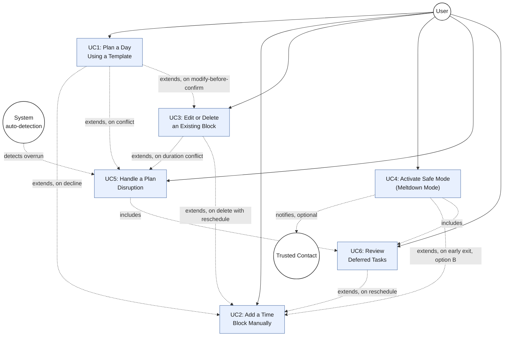
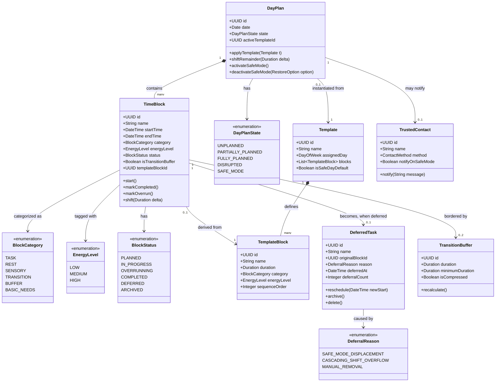
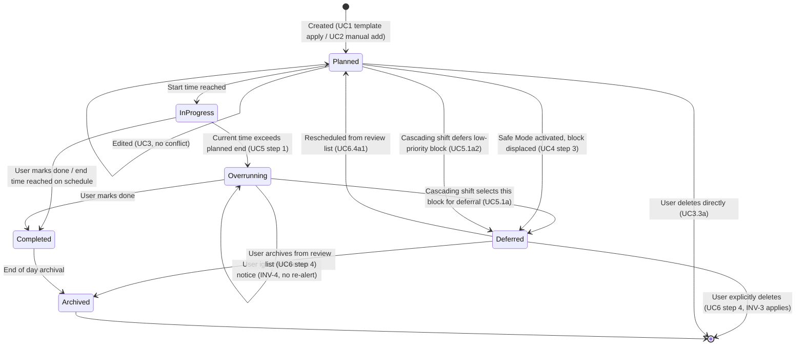
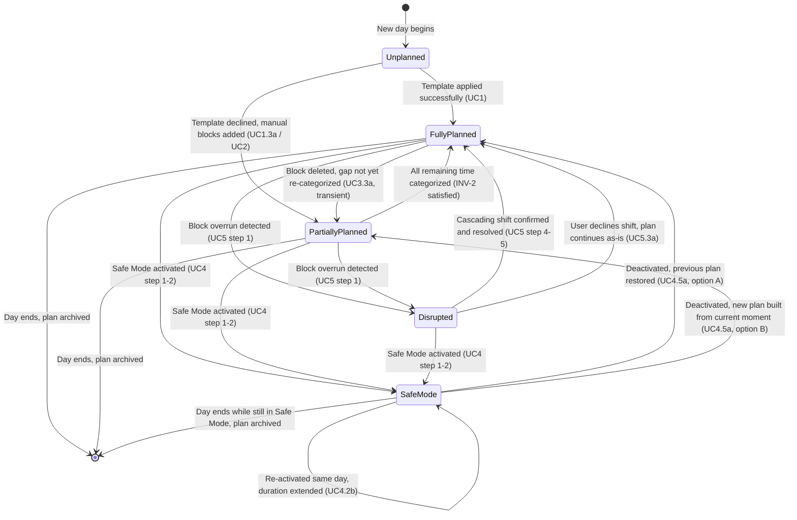

# Time Blocking System for ASD Users — Functional Specification

**Document type:** Software Requirements Specification (Use Case View)
**Notation:** Cockburn-style fully dressed use cases
**Audience:** Engineering, UX, QA, Product

---

## 1. Purpose and Scope

This document specifies the functional behavior of a time-blocking system designed for users on the autism spectrum (ASD). Unlike a generic calendar or task manager, the system's primary design goal is **reduction of decision load and sensory load**, not feature density. Predictability, graceful degradation under disruption, and non-punitive handling of plan deviation are first-class requirements, not edge cases.

This document covers six core use cases, their structural relationships, the underlying data model, and the state behavior that ties them together:

| ID | Use Case | Goal Level |
|----|----------|-----------|
| UC1 | Plan a Day Using a Template | User goal |
| UC2 | Add a Time Block Manually | User goal |
| UC3 | Edit or Delete an Existing Block | User goal |
| UC4 | Activate Safe Mode (Meltdown Mode) | User goal (critical) |
| UC5 | Handle a Plan Disruption (Cascading Shift) | User goal |
| UC6 | Review Deferred Tasks | User goal |

**Document structure:** §2–3 establish actors and invariants; §4 contains the fully-dressed use cases; §5 shows their `include`/`extend` relationships as a use case diagram; §6 derives a data/class model from those use cases; §7 models block- and day-level state transitions; §8 cross-references all of the above.

---

## 2. Actors and Stakeholders

- **Primary Actor — User:** The person on the autism spectrum using the system to manage their day.
- **Secondary Stakeholder — Trusted Contact:** An optional caregiver, family member, or therapist who may receive non-intrusive notifications (see UC4).
- **Secondary Stakeholder — System:** Treated as a stakeholder in its own right, since several invariants (no overlapping blocks, no empty/uncategorized time, no destructive deletion) exist to protect system consistency independent of user intent.

---

## 3. System-Wide Invariants

These hold across all use cases and are referenced rather than repeated:

- **INV-1:** No two blocks may overlap on the timeline.
- **INV-2:** No portion of the day may be left without a category (every minute belongs to some block — task, buffer, rest, or transition).
- **INV-3:** No user data is ever silently deleted. Deferred or replaced blocks are archived, not destroyed, unless the user explicitly confirms deletion.
- **INV-4:** No escalating or repeated alerts. The system surfaces a state once, neutrally, and waits for the next user interaction rather than re-notifying.

---

## 4. Use Cases

### UC1 — Plan a Day Using a Template

| Field | Description |
|---|---|
| **Goal level** | User goal (kite-level) |
| **Primary actor** | User |
| **Stakeholders and interests** | User — wants a day fully populated with minimal morning decision-making. System — must guarantee no gaps in the timeline (INV-2). |
| **Preconditions** | At least one weekly template exists. |
| **Success guarantee** | The day is fully blocked out, including transition buffers, with no gaps. |
| **Minimal guarantee** | No changes are made to the existing template, even if the operation fails. |

**Main success scenario**

1. User opens the day view.
2. System proposes applying the template assigned to that day of the week.
3. User confirms the template application.
4. System generates a full timeline for the day, including automatically inserted transition buffers.
5. System displays the generated plan in the timeline view.
6. User confirms the plan as active for the day.

**Extensions**

- **2a. No template is assigned to this day of the week.**
  - 2a1. System proposes the most recently used template, or a built-in "safe day" template (minimal set: meals, sleep, decompression).
- **3a. User declines to apply the template.**
  - 3a1. System leaves the timeline empty and proceeds to UC2 (Add a Time Block Manually).
- **4a. Template application creates a conflict** (e.g., an external calendar event overlaps a template block).
  - 4a1. System visually flags the conflict without blocking generation of the rest of the plan.
  - 4a2. User resolves the conflict for that specific block via UC5 (Handle a Plan Disruption).
- **6a. User wants to modify the plan before confirming.**
  - 6a1. System transitions to UC3 (Edit or Delete an Existing Block).

---

### UC2 — Add a Time Block Manually

| Field | Description |
|---|---|
| **Goal level** | User goal |
| **Primary actor** | User |
| **Preconditions** | An active day plan exists (full or partial). |
| **Success guarantee** | The new block is placed on the timeline with transition buffers preserved relative to its neighbors. |
| **Minimal guarantee** | The timeline remains in a consistent state (no overlapping blocks, INV-1) regardless of outcome. |

**Main success scenario**

1. User selects "Add Block."
2. User provides: name, duration, category, required energy level.
3. System suggests placement on the timeline based on the first available free slot.
4. User accepts the suggested placement.
5. System inserts the block and automatically generates transition buffers before and after it.
6. System refreshes the timeline view.

**Extensions**

- **2a. User does not provide a category.**
  - 2a1. System requires category as a mandatory field (category drives color-coding and buffer logic); the form cannot be saved without it.
- **3a. No free slot of sufficient length exists in the day.**
  - 3a1. System informs the user in neutral tone ("No space available — would you like to displace a lower-priority block?") and proposes a list of low-priority blocks for displacement.
- **4a. User wants a different placement than suggested.**
  - 4a1. User repositions the block manually (drag-and-drop or slot selection from a list).
  - 4a2. System validates the new placement against the conditions in step 5.
- **4b. The new block partially overlaps an existing block.**
  - 4b1. System rejects the save and highlights the conflicting block (overlap is never permitted — INV-1).
- **5a. Insufficient space remains for a full transition buffer** (e.g., tightly packed blocks).
  - 5a1. System shrinks the buffer to a configurable minimum (e.g., 2 minutes) and flags this visually as a "tight schedule," without a red/warning-style alert.

---

### UC3 — Edit or Delete an Existing Block

| Field | Description |
|---|---|
| **Goal level** | User goal |
| **Primary actor** | User |
| **Preconditions** | The block exists on the active timeline. |
| **Success guarantee** | The change is saved; transition buffers of adjacent blocks are recalculated. |
| **Minimal guarantee** | The original block is preserved if the edit is not confirmed. |

**Main success scenario**

1. User selects an existing block.
2. System displays an edit form pre-filled with current values.
3. User changes selected fields (time, name, category).
4. User confirms.
5. System recalculates transition buffers of adjacent blocks.
6. System saves and refreshes the timeline.

**Extensions**

- **3a. User chooses to delete the block.**
  - 3a1. System asks whether the freed time should become a buffer/rest period or remain "open" to be filled.
  - 3a2. System never leaves the freed time literally uncategorized (INV-2); it defaults to a "buffer" category if no choice is made.
- **4a. The duration change creates a conflict with the next block.**
  - 4a1. System proposes a cascading shift of all subsequent blocks (see UC5).
  - 4a2. User declines the cascade; system caps the change at the maximum value that avoids conflict.
- **1a. The block is part of a recurring template.**
  - 1a1. System asks: "Change only this day" / "Change the entire template."
    - 1a1a. "Only this day" → creates a local exception; the template itself remains unchanged.
    - 1a1b. "Entire template" → proceeds to template editing (separate use case, out of scope for this document).

---

### UC4 — Activate Safe Mode (Meltdown Mode)

| Field | Description |
|---|---|
| **Goal level** | User goal (critical, highest priority) |
| **Primary actor** | User |
| **Stakeholders and interests** | User — needs immediate load reduction with zero required decisions. Trusted contact — may be notified if configured. |
| **Preconditions** | None. This function must be reachable from every screen in a single tap/click. |
| **Success guarantee** | The remainder of the day is reduced to a predefined minimal block set (medication, meals, sleep, decompression); all other tasks are moved to a "later" buffer with no decision required from the user. |
| **Minimal guarantee** | No data is ever deleted (INV-3). Deferred tasks are saved for later review, never permanently discarded. |

**Main success scenario**

1. User activates Safe Mode (single button, always visible, no contextual menu required).
2. System immediately — with no confirmation screen — replaces the remainder of the day with a predefined minimal plan.
3. System moves all displaced tasks to a "to review" list rather than deleting them.
4. System automatically switches the UI to low-stimulation mode for the duration of Safe Mode.
5. User manually deactivates Safe Mode later, when ready.

**Extensions**

- **1a. User has configured an optional trusted-contact notification.**
  - 1a1. System sends a discreet notification (not requiring a response) to the designated contact.
- **2a. No custom safe-day plan has been configured yet.**
  - 2a1. System applies a built-in default general template (rest + basic needs) — the function works even without prior configuration.
- **5a. User attempts to exit Safe Mode before the day has ended.**
  - 5a1. System asks one non-coercive question: restore the previous plan, or start building a new one from the current moment (UC2).
- **2b. Safe Mode is activated a second time on the same day.**
  - 2b1. System extends the duration of Safe Mode without additional prompts (a signal that the first activation was insufficient).

---

### UC5 — Handle a Plan Disruption (Cascading Shift)

| Field | Description |
|---|---|
| **Goal level** | User goal |
| **Primary actor** | User |
| **Preconditions** | An active day plan is in progress; the current time falls within a block or past its planned end. |
| **Success guarantee** | All subsequent blocks for the day are shifted proportionally; the evening buffer absorbs the excess time first. |
| **Minimal guarantee** | No block is ever deleted by this process — at worst it is marked "not completed" and moved to the deferred list. |

**Main success scenario**

1. System detects (or the user reports) that the current block has exceeded its planned end time.
2. System presents a single action: "Shift the rest of the day" (no manual editing of each subsequent block required).
3. User confirms.
4. System shifts all subsequent blocks by the time difference, consuming the evening buffer first.
5. System refreshes the timeline and displays the updated plan.

**Extensions**

- **1a. The overrun exceeds the available evening buffer.**
  - 1a1. System identifies low-priority blocks as candidates for deferral to the next day or removal from today's plan.
  - 1a2. User selects from the proposed list which blocks to defer (the system never auto-defers "basic needs" category blocks).
- **2a. User ignores the overrun notification.**
  - 2a1. System does not generate repeated or escalating alerts (INV-4); it silently marks the block's status as "in progress, overrun" for review at the next interaction.
- **3a. User declines to shift the rest of the day.**
  - 3a1. System leaves the plan unchanged; subsequent blocks remain internally flagged as potentially conflicted at their original start time.
- **4a. The shift causes the "sleep" block to start after a configured threshold** (e.g., after 23:00).
  - 4a1. System flags this neutrally as information, not as a warning.

---

### UC6 — Review Deferred Tasks

| Field | Description |
|---|---|
| **Goal level** | User goal |
| **Primary actor** | User |
| **Preconditions** | The deferred task list contains at least one item (from UC4 or UC5). |
| **Success guarantee** | Every deferred task is assigned to a specific future block, archived, or deleted — by explicit user decision. |
| **Minimal guarantee** | Tasks remain on the deferred list, accessible, no matter how long they go unreviewed. |

**Main success scenario**

1. User opens the deferred task list.
2. System presents the list with context (when and why each task was deferred).
3. User selects a task.
4. User decides: reschedule / archive / delete.
5. System performs the selected action.

**Extensions**

- **4a. User chooses "reschedule."**
  - 4a1. System proceeds to UC2 with the task's data pre-filled.
- **2a. The list contains tasks deferred multiple times (≥3 occurrences).**
  - 2a1. System visually flags these as "consider archiving," without auto-deleting them.
- **1a. The list is long** (configurable threshold, e.g., >15 items).
  - 1a1. System shows only the 5 most recent by default, with an option to expand — preventing visual overload.

---

## 5. Use Case Diagram

This diagram shows the structural relationships between the six use cases — which ones extend others under specific conditions, and which ones include a sub-flow as part of their main scenario. Note that "User" and "System" are drawn as separate actors only where the system's automated detection (e.g., overrun detection in UC5) initiates a flow independently of an explicit user action; everywhere else, the User is the sole initiating actor.

**Reading notes:**

- **`extends`** relationships are conditional — they only fire under the named extension condition (e.g., UC1 extends into UC5 *only* when template application produces a conflict, per extension 4a). They are not part of the main success scenario.
- **`includes`** relationships are unconditional sub-flows that are always part of the including use case's behavior. UC4 and UC5 both place tasks onto the deferred list as a guaranteed side effect (UC4 step 3; UC5 extension 1a1), so they include UC6's data structure even though the user may not immediately *review* that list — the inclusion is about the deferred-list mechanism being invoked, not the user necessarily acting on it in the same session.
- The dotted line from **System (auto-detection)** to UC5 reflects extension 1 of UC5 ("System detects... or the user reports"): this is the one use case in the set with two possible triggering actors.
- UC4 is the only use case with a secondary human stakeholder (**Trusted Contact**) reachable via a notification side effect, never as an initiating actor.

---

## 6. Data / Class Model

This model derives directly from the use cases above — every attribute and relationship exists because some use case step or extension requires it. It deliberately does **not** introduce structures the use cases don't call for.

**Design notes tied back to the use cases:**

- `TimeBlock.isTransitionBuffer` and the separate `TransitionBuffer` class both exist because transition buffers are simultaneously **a category of block** (so they render on the timeline, per FR-1.2 in the earlier requirements discussion) **and a recalculable quantity** (UC2 step 5, UC3 step 5) — splitting them avoids overloading one structure with two different lifecycles.
- `DeferredTask.deferralCount` exists solely to support UC6 extension 2a (flagging tasks deferred ≥3 times) — this is the only place this counter is used, so it stays a field on `DeferredTask` rather than a separately tracked metric.
- `Template.isSafeDayDefault` exists to support UC1 extension 2a1 and UC4 extension 2a1, which both fall back to a built-in safe template — modeling it as a flagged `Template` rather than a hardcoded structure keeps Safe Mode's default plan user-editable like any other template.
- `TimeBlock.templateBlockId` (nullable) is what allows UC3 extension 1a to distinguish "edit this instance only" from "edit the template" — a `TimeBlock` with a non-null reference is a template-derived instance; editing it locally simply clears or retains that link depending on the user's choice.
- No `User` class appears because, for this slice of the system, every structure is implicitly scoped to a single user; multi-user concerns (sharing, permissions) are out of scope for this specification and would be introduced separately if needed.

---

## 7. State Diagrams

The following Mermaid state diagrams model the lifecycle of the two most stateful concepts in the system: a single time block, and the overall day-plan / Safe Mode interaction. These complement the use cases above by showing valid state transitions, which the use case steps and extensions map onto.

### 7.1 Lifecycle of a Single Time Block

Maps to UC1 (block creation via template), UC2 (manual creation), UC3 (edit/delete), and UC5 (overrun handling).

### 7.2 Day Plan / Safe Mode Lifecycle

Maps to UC1, UC4, and UC5 at the whole-day level.

---

## 8. Traceability Notes

- All deletion paths in both diagrams terminate consistently with **INV-3** (archive before delete, explicit confirmation required).
- The `Overrunning --> Overrunning` self-loop in §7.1 and the absence of any repeated-alert transition encode **INV-4** directly into the state model, rather than leaving it as a UI-layer convention.
- No state in either diagram represents "uncategorized time," consistent with **INV-2**; `Unplanned` is a day-level state only, not a block-level one — at the block level, nothing exists until it is `Planned`.
- The class model in §6 and the state diagrams in §7 are consistent with each other: `BlockStatus` enum values map one-to-one onto the states in the §7.1 diagram, and `DayPlanState` maps one-to-one onto §7.2. This is intentional — the state diagrams are the behavioral view of the same status fields the class model defines structurally.
